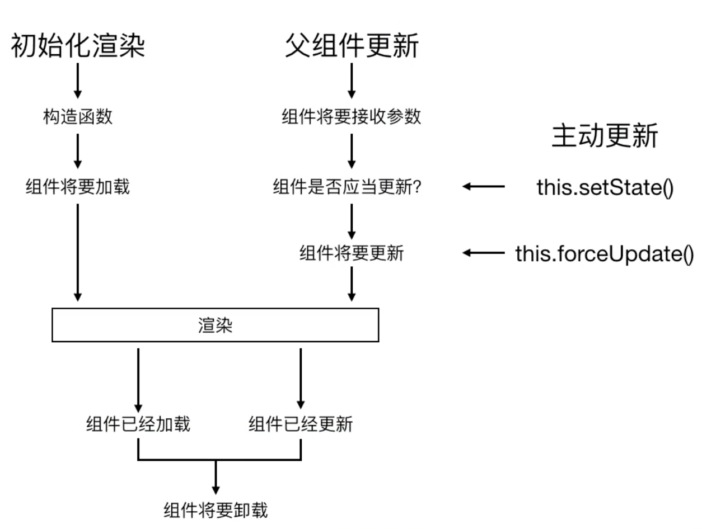
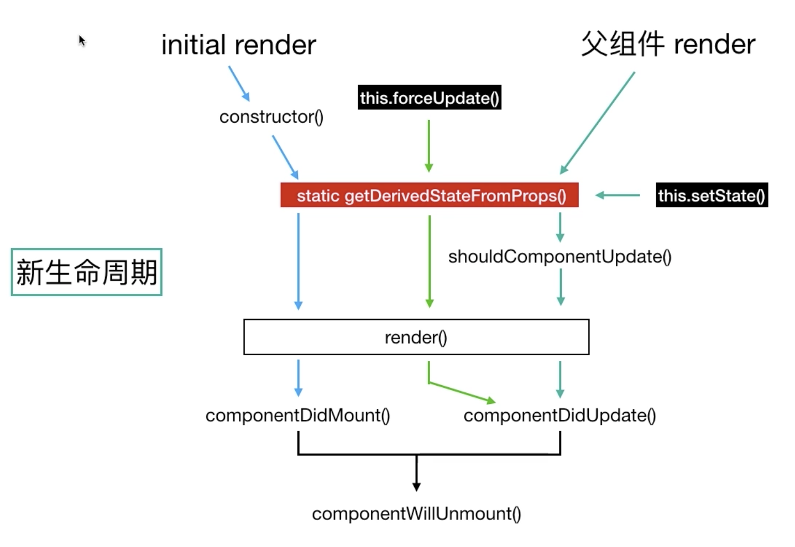

# React 学习

### 一、开发环境安装
1. 使用 `<script src="react.js">` 标签方式引入<br>
  **缺点：** 如果项目较大，需要进行拆分，页面性能很低，不便维护，不推荐这种方式
2. **create-react-app** 脚手架工具安装 
  1. 确保本地开发已安装 [Node](https://nodejs.org/en/) 和 NPM.
  2. 安装 React 脚手架：`npm install -g create-react-app`
  3. 选择目录创建 React 项目：`create-react-app xxxx`
  4. 在已创建好的项目下启动：`npm run start`

### 二、文件说明
- `package-lock.json` 项目依赖的安装包版本管理
- `package.json` node 包文件，第三方依赖包版本管理
- `.gitignore` 用 git 管理的时候，这个文件可以设置一些不需要上传的文件
- `node-modules` 第三方模块包
- `src/serviceWorker` PWA ([Progressive Web Apps](https://developer.mozilla.org/zh-CN/docs/Web/Progressive_web_apps))，渐进式 Web 应用
- `src/App.test.js` 自动化测试文件

### 三、React 中的组件
1. 什么叫组件化开发 [Link #](https://www.zhihu.com/question/29735633)
  - 当需求日积月累，不断变化，页面中必然会有相同的 UI ，如果每个页面单独生产一个，这样维护成本就太大。 
  - 所以就有了“组件化”的概念，把一些重复的代码封装成一个组件，便于复用维护。
2. 下图每个模块都可以作为一个组件


### 四、JSX
- 什么是 [JSX #](https://react.docschina.org/docs/introducing-jsx.html)
- 我们来观察一下声明的这个变量：
  `const element = <h1>Hello, world!</h1>;`
  1. 这种看起来可能有些奇怪的标签语法既不是字符串也不是 HTML。
  2. 它被称为 JSX， 一种 JavaScript 的语法扩展。 我们推荐在 React 中使用 JSX 来描述用户界面。JSX 乍看起来可能比较像是模版语言，但事实上它完全是在 JavaScript 内部实现的。
  3. JSX 用来声明 React 当中的元素。
- 在 JSX 中使用表达式，使用 {} ：
  `render( Hello, {formatName(user)}! )`
- JSX 中的属性
> 因为 JSX 的特性更接近 JavaScript 而不是 HTML , 所以 React DOM 使用 camelCase 小驼峰命名 来定义属性的名称，而不是使用 HTML 的属性名称。
> 例如，class 变成了 className，而 tabindex 则对应着 tabIndex，for 对应 htmlFor。
- 富文本编辑，编译 HTML 标签：
  `<div dangerouslySetInnerHTML = {{ __html: content }} />`

### 五、组件传值
- 父组件通过属性的方式向子组件传值
- 子组件通过 `this.props.xxx` 接受父组件的属性内容
- 传递方法需要在父组件 `bind(this)`

### 六、围绕 React 衍生的思考
- React 是声明式开发
  1. <em>命令式开发</em>：命令“机器”如何去做事情(how)，这样不管你想要的是什么(what)，它都会按照你的命令实现。
  2. <em>声明式开发</em>：告诉“机器”你想要的是什么(what)，让机器想出如何去做(how)。
- 可以与其他框架并存
- 组件化开发
- 单向数据流
  + 父组件可以向子组件传值使用，但是子组件不能直接修改父组件的值
- React 定义为视图层的框架
- 函数式编程

### 七、PropTypes 与 DefaultProps
- 语法使用 [Link #](https://react.docschina.org/docs/typechecking-with-proptypes.html)
- 使用 PropTypes 时，需引用 `import PropTypes from 'prop-types'`
- 当属性没有设置值的时候，就可以定义 DefaultProps

### 八、Props、State 与 render 函数关系
- 当组件的 state 或者 props 发生改变的时候，render 函数就会重新执行。
- 当父组件的 render 函数被运行时，它的子组件的 render 也将重新运行。

### 九、React 的虚拟 DOM
> 当数据的变化实时反映到 UI 上，这时就需要对 DOM 进行操作，但是复杂或频繁的 DOM 操作通常是性能瓶颈产生的原因，为此，React 引入了虚拟 DOM（Virtual DOM）的机制。

- 什么是虚拟 DOM ?
  + 在 React 中，render 执行的结果得到的并不是真正的 DOM 节点，结果仅仅是轻量级的 JavaScript 对象，我们称之为 virtual DOM。
- 虚拟 DOM VS 直接操作原生 DOM ?
  - 如果没有 Virtual DOM，简单来说就是直接重置 innerHTML。这样操作，在一个大型列表所有数据都变了的情况下，还算是合理，但是，当只有一行数据发生变化时，它也需要重置整个 innerHTML，这时候显然就造成了大量浪费。
  - 比较 innerHTML 和 Virtual DOM 的重绘过程如下：
    + innerHTML: render html string + 重新创建所有 DOM 元素
    + Virtual DOM: render Virtual DOM + diff + 必要的 DOM 更新
- 举个步骤例子
  1. state 数据
  2. JSX 模版
  3. 数据 + 模版结合，生成虚拟 DOM （JS 对象，用它来描述真实 DOM）<br/>
      对象：`[ 'div', { id: 'abc' }, ['span', {}, 'hello world' ] ]`
  4. 用虚拟 DOM 的结构生成真实的 DOM 来显示 <br/>
      DOM 例子结果：`<div id="abc"> <span>hello world</span> </div>`
  5. state 发生变化
  6. 数据 + 模版生成一个新的虚拟 DOM <br/>
      对象：`[ 'div', { id: 'abc' }, ['span', {}, 'bye bye' ] ]`
  7. 比较原始虚拟 DOM 和新的虚拟 DOM 的区别，找到 `span` 中的区别
  8. 直接操作 DOM , 改变 `span` 中的内容
- JSX 跟虚拟 DOM 的关系
  + JSX 是由 React 底层的 createElement 进行处理转换
  + 处理过程：<em>JSX -> createElement -> 虚拟 DOM（JS 对象）-> 真实的DOM</em>
- 虚拟 DOM 的优点：
  + 性能提升了
  + 它使得跨端应用得以实现。例如：React Native
  + 在原生应用中是没有 DOM 的概念， 那么虚拟 DOM 的数据可以转换成原生使用的组件。
- 虚拟 DOM 的 diff(difference) 算法
  + 在两个虚拟 DOM 需要比对的时候就要用到 diff 算法
  + diff 算法是同层比对，当第一层不一样时，就不一一对比，而是重新渲染

### 十、生命周期
> 一个组件会经 **创新、更新、删除** 的过程。
> 组件更新有两种方式: `setState forceUpdate`、组件会随父组件的更新而更新

- version React 16 +


- version React 17 + 



### 十一、组件的引用、通信
> 在组件通信之间，尽量保证在自身组件上去修改状态和数据，这样可以避免组件之间的依赖。解决方式是：自身提供一个方法。
组件之间简单的引用可以通过 ref 使用，但更复杂的通信则必须依赖如 redux 这种大型的框架辅助。

- 父组件调用自组件
> 使用 ref 的方式调用

```javascript
class Parent extends React.Component{
  constructor(...args) {
    super(...args);
  };

  fn() {
    this.refs.child.add(this.refs.input.value);
  };

  render() {
    return (
      <div>
        <h2>父组件</h2>
        <input type="text" ref="input" />
        <button onClick={this.fn.bind(this)}>add</button>
        <hr />
        <Child ref="child" /> 
      </div> 
    );
  };
};

class Child extends React.Component{
  constructor(...args) {
    super(...args);

    this.state = {
      a: 0
    }
  };

  add(n) {
    this.setState({
      a: this.state.a + parseInt(n)
    })
  }

  render() {
    return (
      <h2>子组件：{this.state.a}</h2>
    )
  }
}
```


### 十二、Redux
> Redux 是 Javascript 状态容器管理，提供可预测的状态管理，用于数据管理

- 什么场景需要 redux？ 多交互、多数据源
  + 用户的使用方式复杂
  + 不同身份的用户有不同的使用方式（比如普通用户和管理员）
  + 多个用户之间可以协作
  + 与服务器大量交互，或者使用了 WebSocket
  + View 要从多个来源获取数据